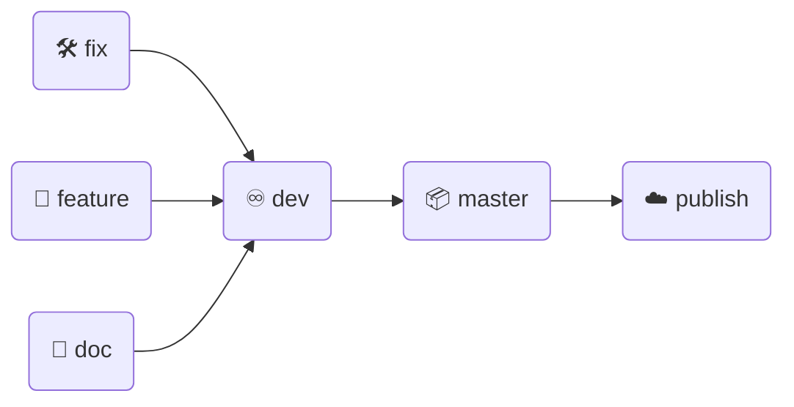
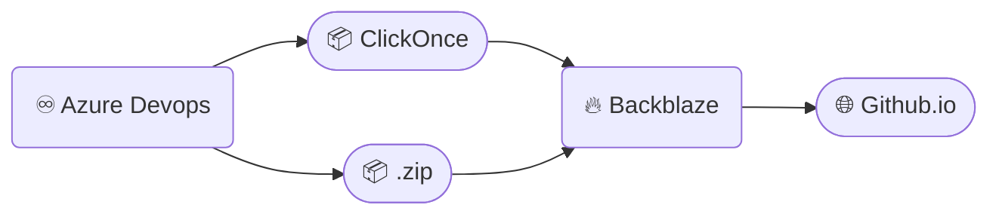

> [!IMPORTANT]
> This page is intended for developers who want to collaborate to improving Ingrid.
> If you are **_non developer_** and want to use Ingrid in your computer please see this [WIKI How to Install Page](https://github.com/ardhagp/Ingrid/wiki/02.-How-to-Install).


#   <span style="color:darkorange">**About Project & Status**</span>
Ingrid is a Desktop Application for Windows OS that has many modules for every purposes, made by your request.

## Project Branch


| Branch | Description | Merge To |
| :--- | :--- | :--- |
| master | For publishing / deployment only | - |
| dev | Active development | master |
| fix | Branch to fixing issues | dev |
| feature | Branch to add new features | dev |
| doc | Branch for updating README / CONTRIBUTING / other documentations | dev |
| publish | Branch for Github.io Project Static Web Page | - |


## Current Status
|Repository Status|
|:---|
|      |

|Sonar Status |
|:---|
|     |
|  |

|Pipeline Status|
|:---|
|[](https://github.com/ardhagp/ingrid/actions/workflows/dev-build.yml) [](https://github.com/ardhagp/ingrid/actions/workflows/release.yml)|

|Uptime Status / Chat / Installer|
|:---|
| [](https://discord.gg/S45J3c7Wnr) [](https://ardhagp.github.io/ingrid/)|


#   <span style="color:darkorange">**Tools You Need**</span>
<span style="color:orange">1.</span>	Visual Studio 2022 Community Edition ([Download](https://visualstudio.microsoft.com/downloads/))<br/>
<span style="color:orange">2.</span>	.NET 8 ([Download](https://dotnet.microsoft.com/en-us/download/dotnet/thank-you/sdk-8.0.423-windows-x64-installer))<br/>
<span style="color:orange">3.</span> Open <span style="color:orange">**User Secret**</span> from <span style="color:orange">**Bridge Project**</span>, see below image.


Then type this json structure.
``` json
{
  "KEYS": {
	"SALT": "<input random characters including Upper and Lower Case, Symbols and Space>",
    "SYNCFUSION": "<input your Syncfusion Key>",
    "BETTERSTACK_LOG": "<input your BetterStack Log Key>",
    "BETTERSTACK_HEARTBEATS": "<input your BetterStack Heartbeats Key>",
    "CLOUDSTORAGE": "<input your Cloudstorage Url>",
    "REPOPAGE": "<input your Repository Page>"
  }
}
```
or simply by editing _secrets.json_ in this directory:
```
%APPDATA%\Microsoft\UserSecrets\f4e0ab0f-a60a-41b1-b56d-d9adae7b959d\
```
----
What if Manage User Secrets context menu doesn't show up?


No worries, you are still able to manage by using Dev PowerShell with this command:

| <span style="color:darkorange">_Dev PowerShell Commands_</span> | <span style="color:darkorange">_Function_</span> |
| -- | -- |
| dotnet user-secrets clear | Delete all KeyName |
| dotnet user-secrets list | Displaying KeyName and its values |
| dotnet user-secrets set KeyName "KeyValue" | Set KeyName and KeyValue |
| dotnet user-secrets remove KeyName | Remove specified KeyName |

then type this command using PowerShell:
```cmd
dotnet user-secrets set KEYS:SALT "<input random characters including Upper and Lower Case, Symbols and Space>"
dotnet user-secrets set KEYS:SYNCFUSION "<input your Syncfusion Key>"
dotnet user-secrets set KEYS:BETTERSTACK_LOG "<input your BetterStack Log Key>"
dotnet user-secrets set KEYS:BETTERSTACK_HEARTBEATS "<input your BetterStack Heartbeats Key>"
dotnet user-secrets set KEYS:CLOUDSTORAGE "<input your Cloudstorage Url>"
dotnet user-secrets set KEYS:REPOPAGE "<input your Repository Page>"
```
> [!WARNING]
> You should use sha256 hash for your _KEYS:SALT_ to prevent error when decrypting stored password.


# About Keys
## 1. Syncfusion
To obtain Syncfusion Key, please sign up with <span style="color:orange">**Community License**</span> and visit this page : [Syncfusion](https://www.syncfusion.com/account/downloads)
Then follow this steps below :


## 2. BetterStack Log
To obtain BetterStack Key, please sign up <span style="color:orange">**BetterStack**</span> and open [https://betterstack.com/settings](https://betterstack.com/settings) 


# About Publishing Plan



#   <span style="color:darkorange">**About License**</span>
This application is released under the [MIT license]($/Ingrid/LICENSE). You can use the code for any purpose, including commercial projects.


#   <span style="color:darkorange">**Navigation**</span>
| [App Page](https://ardhagp.github.io/ingrid) | [Wiki](https://github.com/ardhagp/ingrid/wiki/) | [Status Page](https://stats.uptimerobot.com/w2qHYcTmKb) | Tip (Indonesia) |
| -- | -- | -- | -- |


